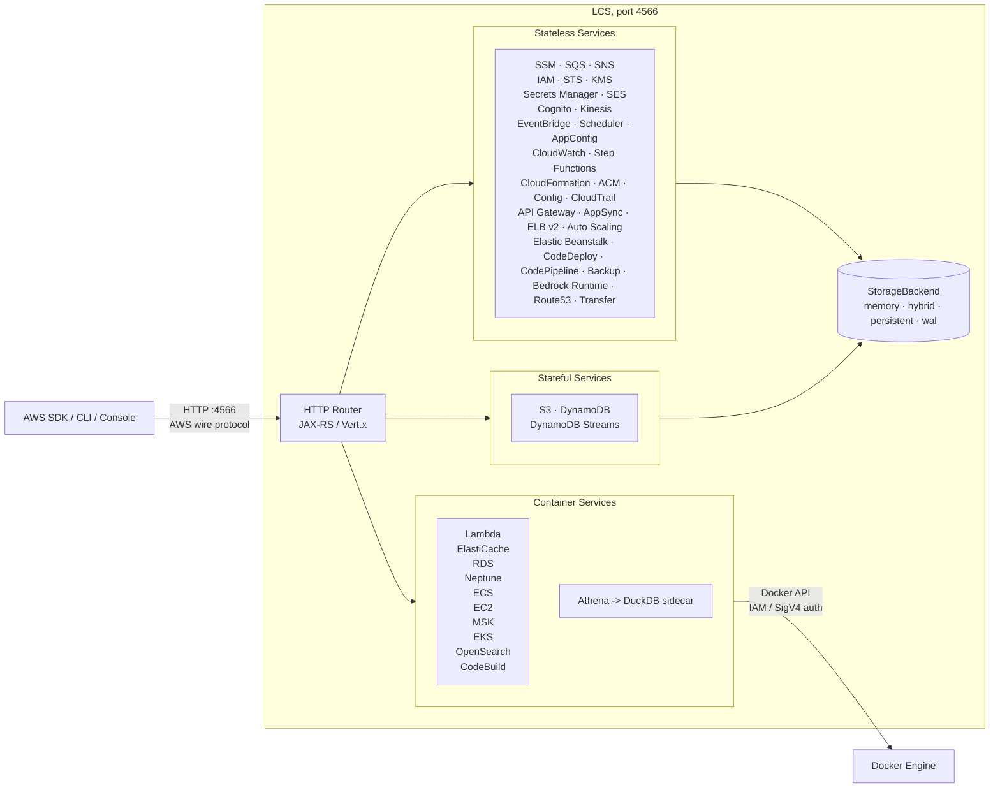

<h1 align="center">LCS — Local Cloud Services</h1>

<p align="center">
  <strong>A free, local AWS emulator for development, testing, and CI.</strong><br />
  No account. No auth token. No feature gates. Just point your tools at <code>localhost:4566</code>.
</p>

<p align="center">
  <a href="https://opensource.org/licenses/MIT"></a>
</p>

<p align="center">
  <a href="#install">Install</a> ·
  <a href="#quick-start">Quick Start</a> ·
  <a href="#features">Features</a> ·
  <a href="#supported-services">Services</a> ·
  <a href="#sdk-integration">SDKs</a> ·
  <a href="#the-console">Console</a> ·
  <a href="#migrating-from-localstack">Migration</a>
</p>

---

## What is LCS?

LCS (Local Cloud Services) is a free, open-source local AWS emulator for development,
testing, and CI. It gives you AWS-shaped services on your machine without a cloud account,
an auth token, or paid feature gates. Point your AWS SDK, CLI, Terraform, CDK, OpenTofu, or
test suite at `http://localhost:4566` and keep your existing workflows.

LCS is built on the Floci codebase and continues as an MIT-licensed derivative with
upstream attribution preserved (see [License](#license)). It is growing into its own
product — a full AWS-replica console, and its own execution work over time.

> **Repository note.** Some Docker image references below use `lcs/lcs`, the tag the
> installers build locally. Where an absolute repository, docs, or registry URL would
> normally appear, this README intentionally omits it until the project's public home is
> set — nothing here points at an upstream repository as though it were this project's.

## Install

Installers set up everything, including Docker if it is missing, and start LCS.

### Windows

Download and run **`LCS-Setup.exe`**.

It checks the machine, shows exactly what it will do, then installs Docker Desktop if
needed, puts the `lcs` command on your PATH, adds Start Menu and Desktop shortcuts, and
starts the emulator. Requires Windows 10 version 2004 (build 19041) or newer, x64 or arm64.
Docker Desktop is fetched from Docker Inc and verified against their code-signing
certificate before it runs; only that step asks for administrator rights.

```powershell
# Unattended, e.g. for provisioning
LCS-Setup.exe /silent
```

Build it from a checkout with `tools\windows\build-installer.ps1`.

### Linux

```bash
./install-lcs.sh
```

Detects the distribution, installs Docker Engine from its package repository (or Docker's
official repository as a fallback), adds you to the `docker` group, installs the `lcs`
command and an application menu entry, and starts the emulator. Works on Debian, Ubuntu,
Fedora, RHEL, CentOS, openSUSE, and Arch.

```bash
# Unattended
./install-lcs.sh --yes
```

Build packages with `tools/linux/build-packages.sh`.

### The `lcs` command

Both installers give you the same command:

```bash
lcs up          # start, wait until ready, open the console
lcs down        # stop and remove the container
lcs restart
lcs status      # is it running, is the console answering
lcs logs        # follow the emulator log
lcs console     # open the console in a browser
```

Options are environment variables on Linux and parameters on Windows:

| Setting | Linux | Windows |
|---|---|---|
| Keep data across restarts | `LCS_DATA=~/.lcs/data` | `-Persist "$env:LOCALAPPDATA\LCS\data"` |
| Different port | `LCS_PORT=4570` | `-Port 4570` |
| Reachable RDS databases | `LCS_DB_PORTS=7000-7019` | `-PublishDbPorts` |
| Different image | `LCS_IMAGE=lcs/lcs:dev` | `-Image lcs/lcs:dev` |

> **LCS listens on `127.0.0.1` only.** It has no authentication and accepts any
> credentials, so anything that can reach the port can drive it — including starting
> containers on the host, since the Docker socket is mounted. Override the bind address
> (`LCS_BIND` / `-BindAddress`) only on a network you control.

Without persistence enabled, resources live in memory and a restart starts empty.

## Quick Start

Already have Docker and just want the container?

```bash
docker run -d --name lcs \
  -p 4566:4566 \
  -v /var/run/docker.sock:/var/run/docker.sock \
  -u root \
  lcs/lcs:latest
```

The Docker socket is needed for the container-backed services (Lambda, RDS, ECS, EC2, and
others). Open `http://localhost:4566/_lcs/ui/` for the console.

Configure your AWS environment:

```bash
export AWS_ENDPOINT_URL=http://localhost:4566
export AWS_DEFAULT_REGION=us-east-1
export AWS_ACCESS_KEY_ID=test
export AWS_SECRET_ACCESS_KEY=test
```

Use your existing AWS tools normally:

```bash
aws s3 mb s3://my-bucket

aws dynamodb create-table \
  --table-name demo-table \
  --attribute-definitions AttributeName=pk,AttributeType=S \
  --key-schema AttributeName=pk,KeyType=HASH \
  --billing-mode PAY_PER_REQUEST

aws dynamodb list-tables
```

All services are available at `http://localhost:4566`. Any region works. Credentials can be
any non-empty values unless you explicitly enable stricter service-specific auth checks.

<details>
<summary>Prefer Docker Compose?</summary>

```yaml
services:
  lcs:
    image: lcs/lcs:latest
    ports:
      - "4566:4566"
    volumes:
      - /var/run/docker.sock:/var/run/docker.sock
```

```bash
docker compose up
```

</details>

## The Console

LCS ships a browser console that talks to the emulator through the AWS SDK for JavaScript —
the same way the real AWS console talks to AWS — served at:

```
http://localhost:4566/_lcs/ui/
```

Every console action is a real signed AWS API call over the wire, so if a screen works the
SDK path works. Core services (S3, EC2, IAM, Lambda, DynamoDB, SQS, SNS, CloudWatch Logs,
RDS, CloudFormation) have AWS-replica surfaces — inventory, detail, and create/edit/delete
flows, including an in-browser Lambda code editor that deploys through `UpdateFunctionCode`.
Every other service is reachable, with API/CLI access available for all of them.

## Features

<details open>
<summary><strong>Local AWS without the cloud account</strong></summary>

Run AWS-compatible services locally without an AWS account, auth token, or paid feature gates.

</details>

<details>
<summary><strong>Real Docker where fidelity matters</strong></summary>

Lambda, RDS, Neptune, ElastiCache, MSK, ECS, EC2, EKS, OpenSearch, and CodeBuild use real Docker-backed execution instead of shallow mocks.

</details>

<details>
<summary><strong>Drop-in AWS compatibility</strong></summary>

Point standard AWS clients at `http://localhost:4566`. Existing credentials, regions, SDKs, CLI commands, and IaC workflows stay familiar.

</details>

<details>
<summary><strong>Fast enough for CI</strong></summary>

The native image starts in milliseconds and keeps idle memory low, making it practical for local development and test pipelines.

</details>

<details>
<summary><strong>Configurable persistence</strong></summary>

Choose from in-memory, persistent, hybrid, and write-ahead log storage depending on the durability profile you need.

</details>

## Why LCS?

LocalStack's community edition [sunset in March 2026](https://blog.localstack.cloud/the-road-ahead-for-localstack/), requiring auth tokens and freezing security updates. LCS is the no-strings-attached alternative.

| Capability | LCS | LocalStack Community |
|---|:---:|:---:|
| Auth token required | No | Yes |
| Security updates | Yes | Frozen |
| Startup time | ~24 ms | ~3.3 s |
| Idle memory | ~13 MiB | ~143 MiB |
| Docker image size | ~90 MB | ~1.0 GB |
| License | MIT | Restricted |
| API Gateway v2 / HTTP API | Yes | No |
| Cognito | Yes | No |
| RDS, ElastiCache, MSK | Real Docker | No |
| Neptune (graph DB + Gremlin WebSocket) | Real Docker | No |
| DocumentDB (MongoDB-compatible) | Real Docker | No |
| ECS, EC2, EKS | Real Docker | No |
| CodeBuild | Real Docker execution | No |
| Native binary | ~40 MB | No |

**Broad coverage. Free forever.**

## Architecture Overview



## Supported Services

LCS supports local emulation for application services, data services, eventing, identity, infrastructure, billing, and container-backed workloads.

| Category | Services |
|---|---|
| Core app services | S3, SQS, SNS, DynamoDB, Lambda, IAM, KMS, Secrets Manager, SSM |
| Events and workflows | EventBridge, EventBridge Pipes, EventBridge Scheduler, Step Functions, CloudWatch Logs, CloudWatch Metrics |
| API and identity | API Gateway REST, API Gateway v2, AppSync, Cognito, ACM, Route53, Cloud Map |
| Containers and compute | ECS, EC2, Lightsail, EKS, ECR, CodeBuild, CodeDeploy, CodePipeline, AWS Batch, Auto Scaling, Elastic Beanstalk, ELB v2 |
| Data, analytics, and AI | Athena, Glue, EMR, Firehose, OpenSearch, S3 Vectors, Textract, Transcribe, Bedrock Runtime |
| Databases and caching | RDS, RDS Data API, Neptune, DocumentDB, MemoryDB, ElastiCache |
| Messaging and transfer | SES, Kinesis, MSK, Amazon MQ, Transfer Family, IoT Core |
| Security and governance | WAF v2, CloudTrail, CloudFront, Resource Groups Tagging API |
| Cost and billing | Pricing, Cost Explorer, Cost and Usage Reports, BCM Data Exports |
| Backup and config | AWS Backup, AWS Config, AppConfig, AppConfigData, CloudFormation, Cloud Control API |

<details>
<summary>Detailed service notes</summary>

| Service | How it works | Notable features |
|---|---|---|
| SSM | In-process + EC2 containers | Parameter Store (version history, labels, SecureString, tagging); Run Command (SendCommand, GetCommandInvocation, direct EC2 container execution, agent polling) |
| SQS | In-process | Standard and FIFO queues, DLQ, visibility timeout, batch operations, tagging |
| SNS | In-process | Topics, subscriptions, SQS, Lambda and HTTP delivery, tagging |
| S3 | In-process | Versioning, multipart upload, pre-signed URLs, Object Lock, event notifications |
| S3 Vectors | In-process | Vector buckets, indexes, put / get / list / delete vectors, cosine similarity queries |
| DynamoDB | In-process | GSI, LSI, Query, Scan, TTL, transactions, batch operations; Streams with shard iterators and Lambda event source mapping |
| Lambda | Real Docker | Runtime environment, execution model, warm container pool, aliases, Function URLs |
| API Gateway REST | In-process | Resources, methods, stages, Lambda proxy, MOCK integrations, AWS integrations |
| API Gateway v2 | In-process | HTTP APIs, routes, integrations, JWT authorizers, stages |
| AppSync | In-process | GraphQL API management API, schema registry, AWS scalars, domain names, channel namespaces |
| IAM | In-process | Users, roles, groups, policies, instance profiles, access keys; STS AssumeRole, WebIdentity, SAML, GetFederationToken, GetSessionToken |
| Cognito | In-process | User pools, app clients, auth flows, JWKS and OpenID well-known endpoints |
| KMS | In-process | Encrypt, decrypt, sign, verify, data keys, aliases |
| Kinesis | In-process | Streams, shards, enhanced fan-out, split and merge |
| Secrets Manager | In-process | Versioning, resource policies, tagging |
| Step Functions | In-process | ASL execution, task tokens, execution history |
| CloudFormation | In-process | Stacks, change sets, resource provisioning, StackSets (cross-account instances) |
| EventBridge | In-process | Custom buses, rules, SQS, SNS and Lambda targets |
| EventBridge Pipes | In-process | Poller-based integration connecting SQS, Kinesis, DynamoDB, and MSK sources to targets with optional filtering |
| EventBridge Scheduler | In-process | Schedule groups, schedules, flexible time windows, retry policies, DLQs |
| CloudWatch Logs | In-process | Log groups, streams, ingestion, filtering |
| CloudWatch Metrics | In-process | Custom metrics, statistics, alarms |
| ElastiCache | Real Docker | Redis / Valkey protocol, IAM auth, SigV4 validation |
| MemoryDB | Real Docker | Redis / Valkey protocol via real containers; JSON 1.1 control plane; reuses ElastiCache RESP proxy |
| RDS | Real Docker | PostgreSQL, MySQL, MariaDB, IAM auth, JDBC-compatible engines |
| RDS Data API | REST JSON over real RDS containers | Raw SQL execution and transactions for local MySQL / MariaDB RDS resources |
| Neptune | Real Docker | Graph DB via TinkerPop Gremlin Server (default) or Neo4j for openCypher/Bolt; RDS-shaped control plane; SigV4 proxy on port 8182 |
| DocumentDB | Real Docker, mock mode available | MongoDB-compatible cluster via real MongoDB containers; RDS-shaped control plane; MongoDB wire protocol on port 27017 |
| MSK | Real Docker | Kafka-compatible broker via Redpanda |
| Amazon MQ | Real Docker | RabbitMQ broker via rabbitmq:3-management; AMQP + management console |
| Athena | In-process with DuckDB sidecar | Real SQL execution over S3 and Glue-backed views |
| Glue | In-process | Data Catalog, Schema Registry, tables consumed by Athena |
| EMR | In-process | Cluster (job flow) lifecycle, instance groups and fleets, steps, security configurations, tagging |
| Data Firehose | In-process | Streaming delivery, NDJSON flush to S3 |
| ECS | Real Docker | Clusters, task definitions, tasks, services, capacity providers, task sets |
| EC2 | Real Docker | RunInstances launches containers, SSH key injection, UserData, IMDS, VPC resources |
| Lightsail | In-process | Instances, disks, static IPs, key pairs, ports, tags, regions, blueprints, bundles, operations |
| ACM | In-process | Certificate issuance and validation lifecycle |
| ECR | In-process with real registry | Repositories, docker push / pull, image-backed Lambda functions |
| Resource Groups Tagging API | In-process | GetResources, tag and untag resources, tag key and value discovery across services |
| SES | In-process | v1 and v2 APIs: send email, raw email, identity verification, DKIM, templates, configuration sets, account sending |
| OpenSearch | Real Docker | Domain CRUD, tags, versions, instance types, upgrade stubs |
| AppConfig | In-process | Applications, environments, profiles, hosted versions, deployments |
| AppConfigData | In-process | Configuration sessions and dynamic configuration retrieval |
| Bedrock Runtime | In-process stub | Dummy Converse and InvokeModel responses for local development |
| EKS | Real Docker, mock mode available | k3s clusters with live Kubernetes API server |
| ELB v2 | In-process | ALB, NLB, target groups, listeners, routing rules, Lambda targets, tags |
| CodeBuild | In-process with real Docker | Real buildspec execution, CloudWatch logs, S3 artifacts |
| CodeDeploy | In-process with Lambda traffic shifting | Deployment groups, configs, lifecycle hooks, auto-rollback |
| CodePipeline | In-process orchestration | Pipelines, executions, S3 artifacts, approvals, local providers, custom workers |
| AWS Batch | In-process | Compute environments, job queues, job definitions, job submission and lifecycle |
| Auto Scaling | In-process with reconciler | Launch configs, ASGs, desired capacity reconciliation, lifecycle hooks |
| Elastic Beanstalk | In-process | Applications, application versions, environments, configuration templates, platform and solution stack metadata |
| AWS Backup | In-process | Vaults, backup plans, selections, simulated job lifecycle, recovery points |
| AWS Config | In-process | Config rules, configuration recorders, delivery channels, conformance packs, tagging |
| CloudTrail | In-process | Trails, event selectors, `StartLogging`/`StopLogging`, scheduled gzipped log file emission, IAM-deny path emits `AccessDenied` records |
| CloudFront | In-process | Distributions, origins, cache behaviors, invalidations, tagging |
| WAF v2 | In-process | Web ACLs, IP sets, regex pattern sets, rule groups, logging configs, resource associations, tagging |
| Route53 | In-process | Hosted zones, SOA and NS records, resource record sets, change tracking, tagging |
| Cloud Map | In-process | HTTP and DNS namespaces, services, instance registration, discovery queries, operations, tagging |
| Transfer Family | In-process | Server lifecycle, user management, SSH key import, tagging |
| Textract | In-process stub | API-compatible stubs, dummy block data, async job simulation |
| Transcribe | In-process stub | Transcription jobs and custom vocabularies; jobs complete immediately |
| Pricing | In-process with static snapshot | Product discovery, attributes, price list files, pagination |
| Cost Explorer | In-process | Cost synthesized from resource state and pricing snapshots |
| Cost and Usage Reports | In-process with DuckDB sidecar | CUR 2.0 and FOCUS 1.2 columns, account-scoped storage, Parquet emission |
| BCM Data Exports | In-process | Export lifecycle, executions, update and delete operations |

</details>

## Real Docker Integration

LCS uses real Docker containers when in-process emulation would reduce fidelity. This applies to stateful databases, connection-heavy protocols, runtimes, and build systems.

| Service | Default image | What is real |
|---|---|---|
| Lambda | `public.ecr.aws/lambda/<runtime>` | AWS runtime environment, execution model, warm container pool |
| ElastiCache | `valkey/valkey:8` | Redis / Valkey protocol, ACL-based IAM auth, SigV4 validation |
| RDS PostgreSQL | `postgres:16-alpine` | PostgreSQL engine, IAM auth, JDBC-compatible access |
| RDS MySQL / Aurora | `mysql:8.0` | MySQL engine, IAM auth, JDBC-compatible access |
| RDS MariaDB | `mariadb:11` | MariaDB engine, IAM auth, JDBC-compatible access |
| Neptune | `tinkerpop/gremlin-server:3.7.3` | TinkerPop Gremlin Server; Gremlin WebSocket on port 8182; SigV4 auth proxy |
| DocumentDB | `mongo:7.0` | MongoDB engine; MongoDB wire protocol on port 27017 |
| MSK | `redpandadata/redpanda:latest` | Kafka-compatible broker via Redpanda |
| Amazon MQ | `rabbitmq:3-management` | RabbitMQ broker; AMQP on port 5672, management console on 15672 |
| EC2 | AMI-mapped Linux images | Linux containers, SSH key injection, UserData, IMDS, IAM credentials |
| ECS | User-specified task image | Container lifecycle, start, stop, health checks |
| EKS | `rancher/k3s:latest` | Kubernetes API server via k3s |
| CodeBuild | User-specified environment image | Buildspec execution, log streaming, S3 artifact upload |
| OpenSearch | `opensearchproject/opensearch:2` | Full OpenSearch engine with REST API |
| ECR | `registry:2` | OCI-compatible registry for docker push and docker pull |

Docker-backed services require the Docker socket, as shown in [Quick Start](#quick-start).

## Persistence and Storage Modes

LCS can trade speed for durability depending on the workflow. Configure the default mode with `FLOCI_STORAGE_MODE`, or override storage per service.

| Mode | Behavior | Best for | Durability |
|---|---|---|:---:|
| `memory` | Entirely in RAM. Data is lost when the container stops. | CI and ephemeral tests | None |
| `persistent` | Loaded at startup and flushed to disk immediately on every write. | Simple local state preservation | Medium |
| `hybrid` | In-memory performance with periodic async flushing every 5 seconds. | Local development | Good |
| `wal` | Write-ahead log. Every mutation is logged before responding. | Maximum durability | Highest |

## Multi-Account Isolation

LCS supports per-account resource isolation with no extra setup. If `AWS_ACCESS_KEY_ID` is exactly 12 digits, LCS uses it as the account ID. Resources created by one account are invisible to another.

```bash
AWS_ACCESS_KEY_ID=111111111111 aws sqs create-queue --queue-name orders
AWS_ACCESS_KEY_ID=222222222222 aws sqs create-queue --queue-name orders
```

Any other key format falls back to `FLOCI_DEFAULT_ACCOUNT_ID`, which defaults to `000000000000`. STS temporary credentials from `AssumeRole` resolve to the assumed role's account, so the cross-account assume-role-then-provision pattern works locally.

## SDK Integration

Point your existing AWS SDK at `http://localhost:4566`.

<details>
<summary><strong>Java, AWS SDK v2</strong></summary>

```java
var client = DynamoDbClient.builder()
    .endpointOverride(URI.create("http://localhost:4566"))
    .region(Region.US_EAST_1)
    .credentialsProvider(StaticCredentialsProvider.create(
        AwsBasicCredentials.create("test", "test")))
    .build();

client.createTable(b -> b
    .tableName("demo-table")
    .billingMode(BillingMode.PAY_PER_REQUEST)
    .attributeDefinitions(
        AttributeDefinition.builder().attributeName("pk").attributeType(ScalarAttributeType.S).build())
    .keySchema(
        KeySchemaElement.builder().attributeName("pk").keyType(KeyType.HASH).build()));

System.out.println(client.listTables().tableNames());
```

</details>

<details>
<summary><strong>Python, boto3</strong></summary>

```python
import boto3

client = boto3.client(
    "ssm",
    endpoint_url="http://localhost:4566",
    region_name="us-east-1",
    aws_access_key_id="test",
    aws_secret_access_key="test",
)

client.put_parameter(Name="/demo/app/message", Value="hello from lcs", Type="String", Overwrite=True)
print(client.get_parameter(Name="/demo/app/message")["Parameter"]["Value"])
```

</details>

<details>
<summary><strong>Node.js, AWS SDK v3</strong></summary>

```javascript
import { SQSClient, SendMessageCommand } from "@aws-sdk/client-sqs";

const client = new SQSClient({
  endpoint: "http://localhost:4566",
  region: "us-east-1",
  credentials: { accessKeyId: "test", secretAccessKey: "test" },
});

await client.send(
  new SendMessageCommand({
    QueueUrl: "http://localhost:4566/000000000000/demo-queue",
    MessageBody: "hello from lcs",
  }),
);
```

</details>

<details>
<summary><strong>Bash, AWS CLI</strong></summary>

```bash
export AWS_ACCESS_KEY_ID=test
export AWS_SECRET_ACCESS_KEY=test
export AWS_DEFAULT_REGION=us-east-1

aws --endpoint-url http://localhost:4566 s3 mb s3://my-bucket
aws --endpoint-url http://localhost:4566 s3 ls
```

</details>

## Compatibility Testing

The [`compatibility-tests`](./compatibility-tests/) directory validates LCS across SDKs and tooling workflows.

| Module | Language / Tool | SDK / Client |
|---|---|---|
| `sdk-test-java` | Java | AWS SDK for Java v2 |
| `sdk-test-node` | Node.js | AWS SDK for JavaScript v3 |
| `sdk-test-python` | Python 3 | boto3 |
| `sdk-test-go` | Go | AWS SDK for Go v2 + RDS Data API SDK v1 |
| `sdk-test-awscli` | Bash | AWS CLI v2 |
| `compat-terraform` | Terraform | v1.10+ |
| `compat-opentofu` | OpenTofu | v1.9+ |
| `compat-cdk` | AWS CDK | v2+ |

Thousands of automated compatibility tests run across these SDKs and IaC tools.

## Migrating from LocalStack

LCS is a drop-in replacement for LocalStack Community. The port, credentials, SDK configuration, and CLI endpoint pattern work the same way. Swap the image and keep going.

```yaml
# Before
image: localstack/localstack

# After
image: lcs/lcs:latest
```

LocalStack environment variables are translated automatically:

| LocalStack | LCS equivalent |
|---|---|
| `LOCALSTACK_HOST` | `FLOCI_HOSTNAME` |
| `PERSISTENCE=1` | `FLOCI_STORAGE_MODE=persistent` |
| `LAMBDA_DOCKER_NETWORK` | `FLOCI_SERVICES_LAMBDA_DOCKER_NETWORK` |
| `LAMBDA_REMOVE_CONTAINERS=1` | `FLOCI_SERVICES_LAMBDA_EPHEMERAL=true` |
| `DEBUG=1` | `QUARKUS_LOG_LEVEL=DEBUG` |

Init scripts mounted under `/etc/localstack/init/` run unchanged. The `/_localstack/init` and `/_localstack/health` endpoints are still served, and the log ends with a LocalStack-style `Ready.` line so existing wait strategies work. Set `LOCALSTACK_PARITY=false` to opt out.

## Configuration

Settings are overridable through environment variables.

> **Environment-variable prefix.** Configuration keys currently use the `FLOCI_` prefix,
> inherited from the upstream codebase. The runtime rename to an LCS-native prefix is a
> planned, separate change; until then these names are what the running image reads, so
> they are documented verbatim.

| Variable | Default | Description |
|---|---|---|
| `FLOCI_PORT` | `4566` | Port exposed by the LCS API |
| `FLOCI_DEFAULT_REGION` | `us-east-1` | Default AWS region |
| `FLOCI_DEFAULT_ACCOUNT_ID` | `000000000000` | Default AWS account ID |
| `FLOCI_BASE_URL` | `http://localhost:4566` | Base URL used when LCS returns service URLs |
| `FLOCI_HOSTNAME` | Unset | Hostname used in returned URLs when LCS runs inside Docker Compose |
| `FLOCI_STORAGE_MODE` | `memory` | Storage mode: `memory`, `persistent`, `hybrid`, or `wal` |
| `FLOCI_STORAGE_PERSISTENT_PATH` | `./data` | Directory used for persisted state |
| `FLOCI_TLS_ENABLED` | `false` | Serve over HTTPS (self-signed); pair with `NODE_TLS_REJECT_UNAUTHORIZED=0` for the JS SDK |
| `FLOCI_ECR_BASE_URI` | `public.ecr.aws` | ECR base URI used when pulling container images |
| `FLOCI_SERVICES_S3_ENFORCE_AUTH` | `false` | Enforce S3 access checks and reject unknown signed S3 access keys |

### Multi-container Docker Compose

When your application runs in a different container, set `FLOCI_HOSTNAME` to the LCS service name so returned URLs resolve correctly.

```yaml
services:
  lcs:
    image: lcs/lcs:latest
    ports:
      - "4566:4566"
    environment:
      - FLOCI_HOSTNAME=lcs

  my-app:
    environment:
      - AWS_ENDPOINT_URL=http://lcs:4566
    depends_on:
      - lcs
```

## License

MIT — see [LICENSE](LICENSE).

LCS is built on the Floci codebase and preserves upstream attribution in
[NOTICE](NOTICE) and [LICENSES/UPSTREAM-FLOCI-MIT.txt](LICENSES/UPSTREAM-FLOCI-MIT.txt).
The MIT license requires that the original copyright notice be preserved; it is, and
this project remains MIT-licensed.
